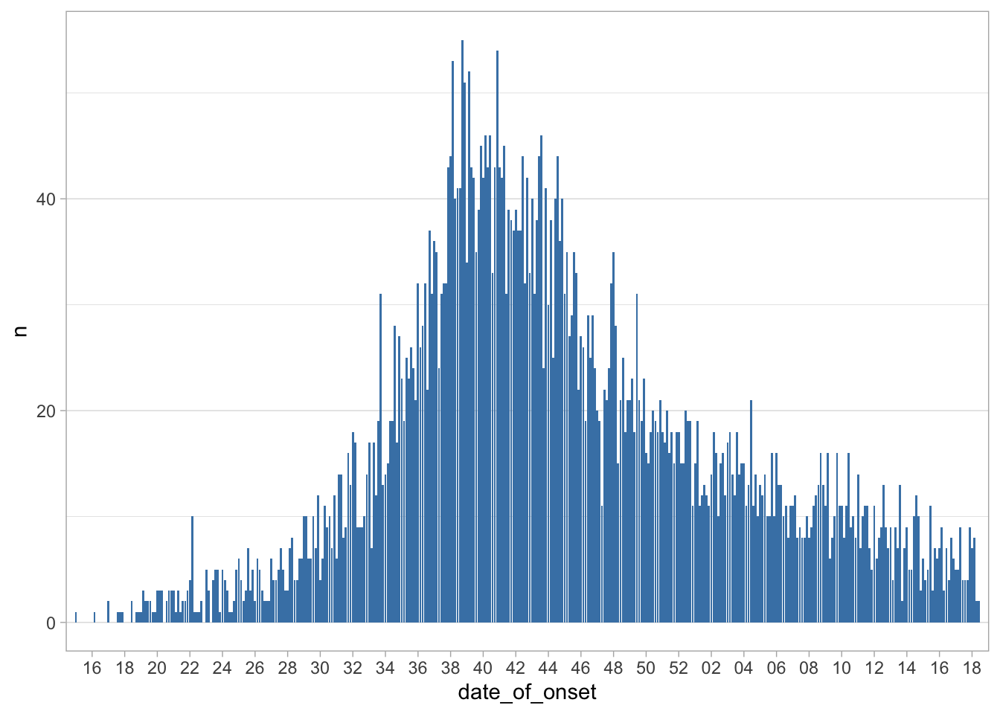
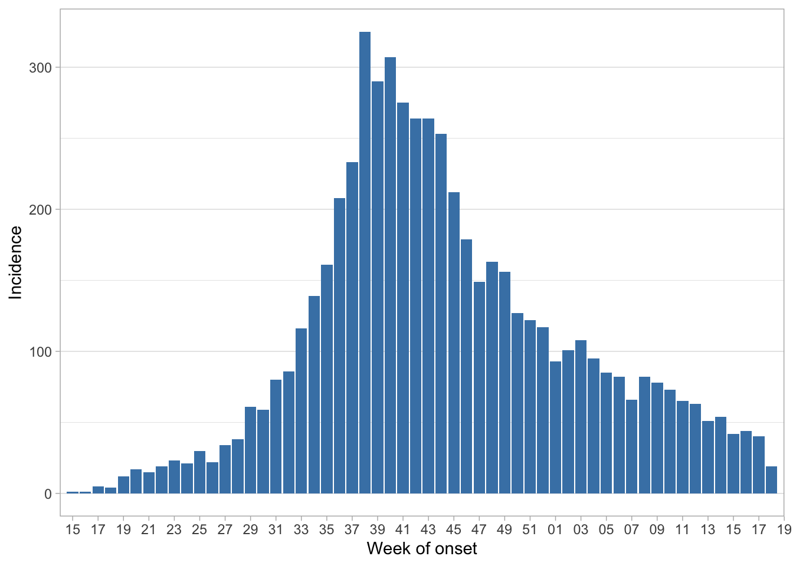
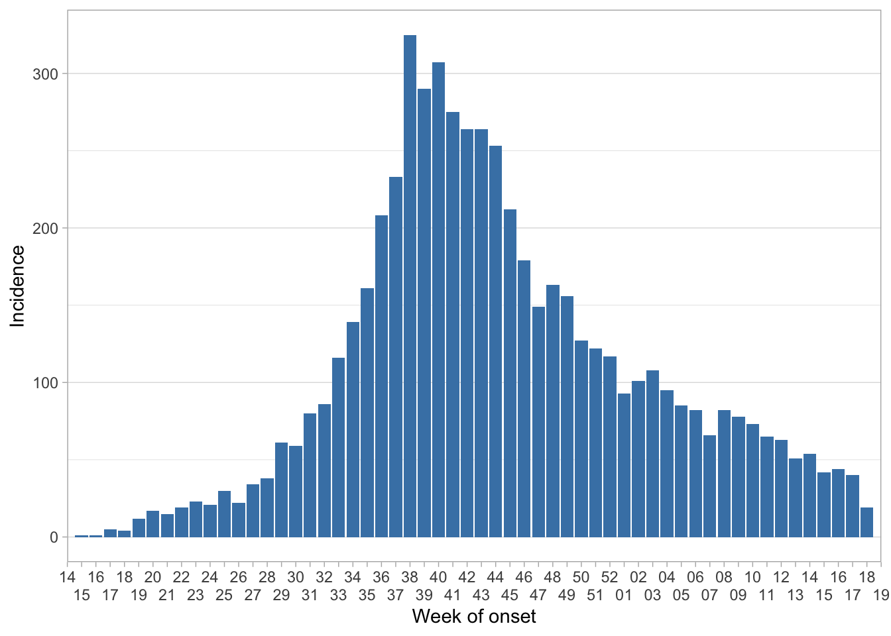
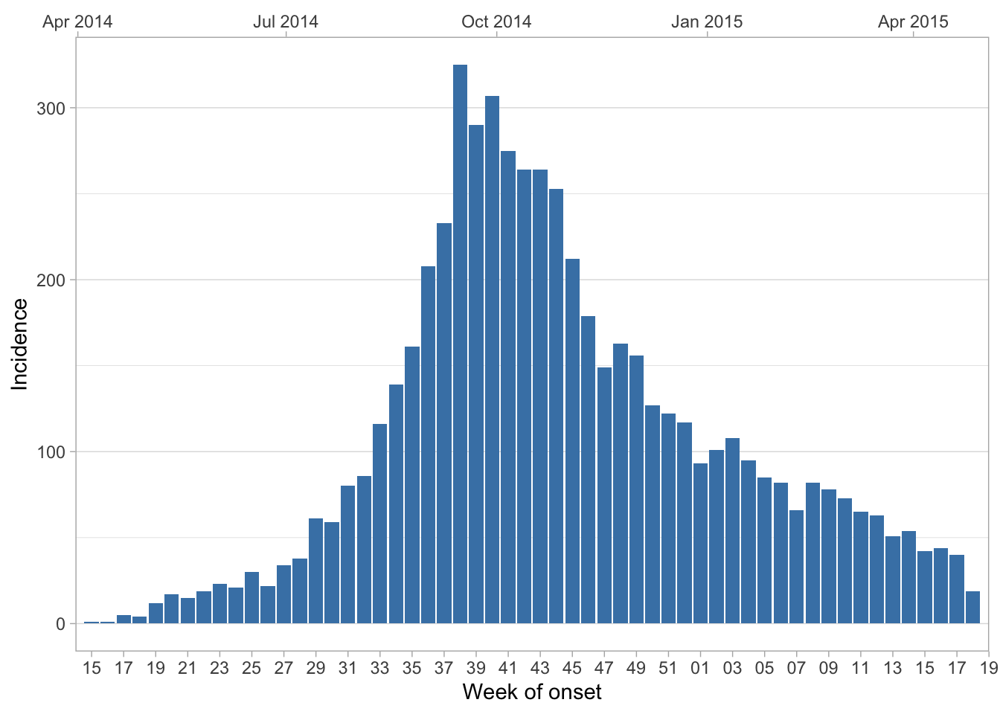
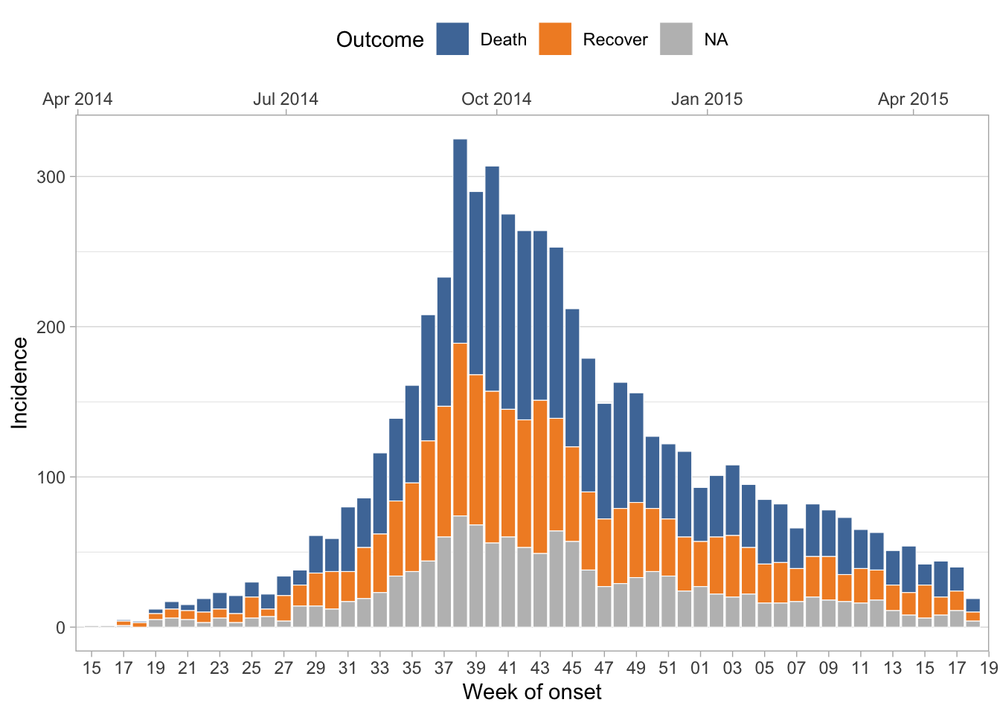
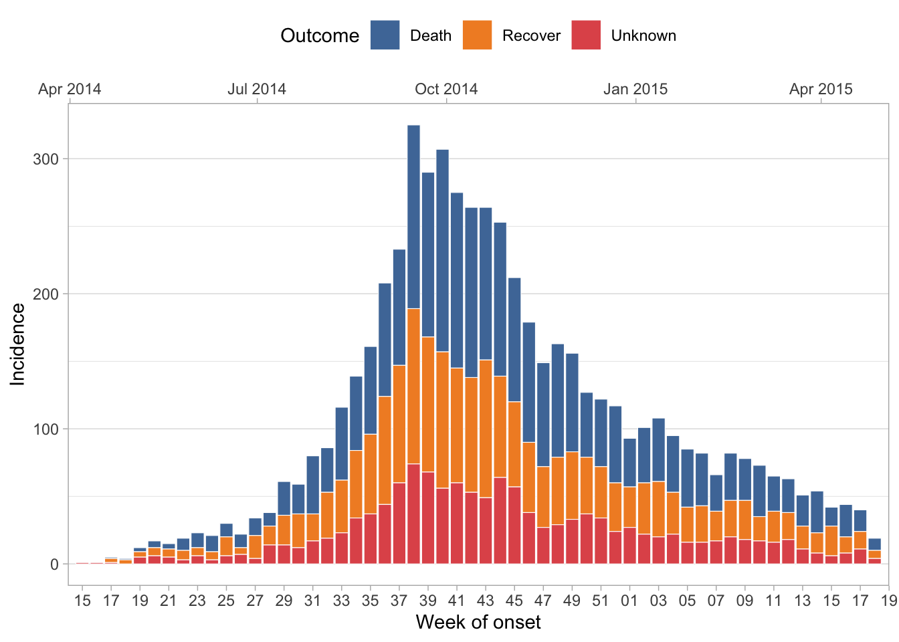
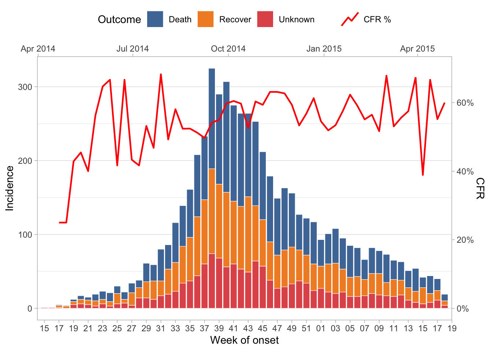
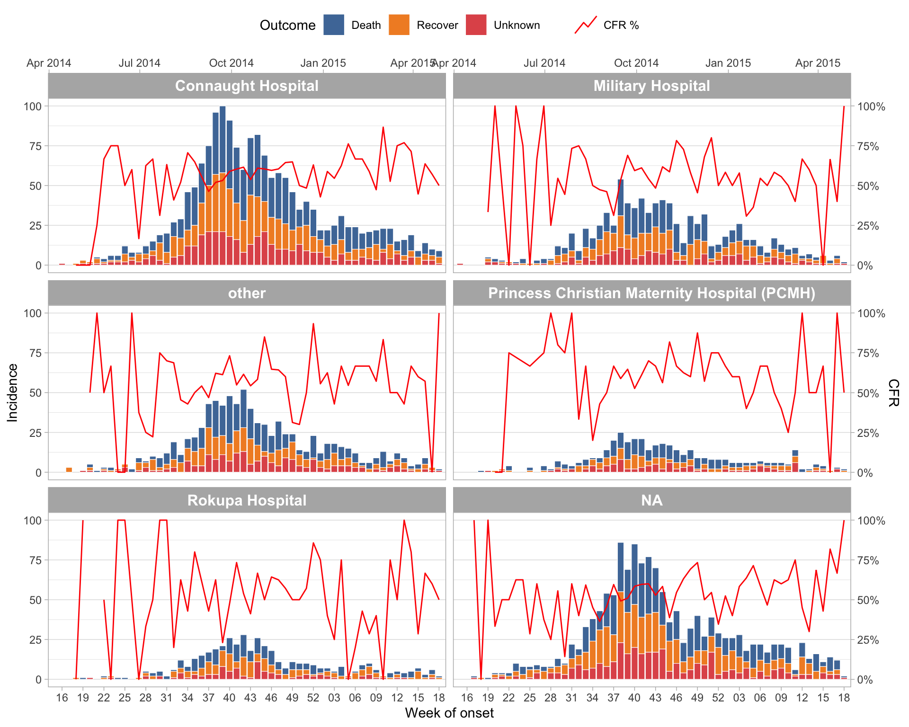
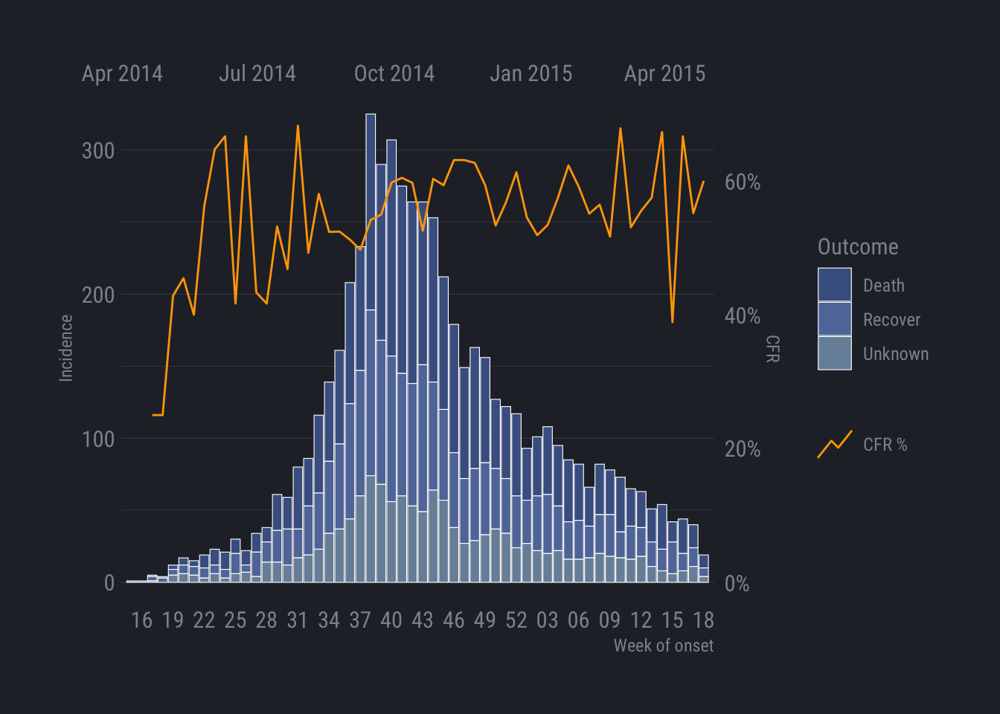

<!-- README.md is generated from README.Rmd. Please edit that file -->

# epivis

<!-- badges: start -->

[](https://www.tidyverse.org/lifecycle/#experimental)
<!-- badges: end -->

Tools for visualising epidemiological data.

## Installation

You can install the package from github with the `remotes` package:

``` r
remotes::install_github("epicentre-msf/epivis")
```

## Epicurves

The package currently contains a single primary function `plot_epicurve`
for plotting incidence over time. It is designed to work with
non-aggregated data, i.e. patient level linelist data.

We’ll use a simulated ebola outbreak dataset from the `{outbreaks}`
package for our examples.

``` r
library(dplyr)
library(ggplot2)
library(epivis)
library(outbreaks) # for example linelist data install.packages("outbreaks")

df_ebola <- as_tibble(outbreaks::ebola_sim_clean$linelist)

glimpse(df_ebola)
#> Rows: 5,829
#> Columns: 11
#> $ case_id                 <chr> "d1fafd", "53371b", "f5c3d8", "6c286a", "0f58…
#> $ generation              <int> 0, 1, 1, 2, 2, 0, 3, 3, 2, 3, 4, 3, 4, 2, 4, …
#> $ date_of_infection       <date> NA, 2014-04-09, 2014-04-18, NA, 2014-04-22, …
#> $ date_of_onset           <date> 2014-04-07, 2014-04-15, 2014-04-21, 2014-04-…
#> $ date_of_hospitalisation <date> 2014-04-17, 2014-04-20, 2014-04-25, 2014-04-…
#> $ date_of_outcome         <date> 2014-04-19, NA, 2014-04-30, 2014-05-07, 2014…
#> $ outcome                 <fct> NA, NA, Recover, Death, Recover, NA, Recover,…
#> $ gender                  <fct> f, m, f, f, f, f, f, f, m, m, f, f, f, f, f, …
#> $ hospital                <fct> Military Hospital, Connaught Hospital, other,…
#> $ lon                     <dbl> -13.21799, -13.21491, -13.22804, -13.23112, -…
#> $ lat                     <dbl> 8.473514, 8.464927, 8.483356, 8.464776, 8.452…
```

You can plot a simple curve by providing the dataset and the bare column
name containing the dates you want to plot:

``` r
plot_epicurve(
  df_ebola, 
  date_col = date_of_onset
)
```



A note of default date labels: commonly epidemic curves are plotted by
week, not day. As such, default date labels are set as ISO Week (00-53)
at an interval of 2 weeks. This default is not appropriate for the daily
data we have supplied, but we can fix this with built-in function
arguments…

Firstly we can add a `floor_date_week = TRUE` argument to group all
dates to the first monday of the ISO Week they fall in (this is required
for ggplot weekly tick marks to align properly with the columns). We
also add some more informative axis labels:

``` r
plot_epicurve(
  df_ebola, 
  date_col = date_of_onset, 
  floor_date_week = TRUE, 
  date_lab = "Week of onset", 
  y_lab = "Incidence"
)
```



We can change the date break intervals with the `date_breaks` argument:

``` r
plot_epicurve(
  df_ebola, 
  date_col = date_of_onset, 
  floor_date_week = TRUE, 
  date_breaks = "3 weeks", 
  date_lab = "Week of onset", 
  y_lab = "Incidence"
)
```


If you want to display more week labels but avoid overlapping, you can
use the `dodge_x_labs` helper function:

``` r
plot_epicurve(
  df_ebola, 
  date_col = date_of_onset, 
  floor_date_week = TRUE,
  date_breaks = "1 week", 
  date_lab = "Week of onset", 
  y_lab = "Incidence"
) +
  dodge_x_labs()
```



Since week numbers alone don’t give us any information about the year
they relate to, it can be useful to add a secondary date axis to display
more standard date labels. This can be done with the `sec_date_axis =
TRUE` argument:

``` r
plot_epicurve(
  df_ebola, 
  date_col = date_of_onset, 
  floor_date_week = TRUE, 
  sec_date_axis = TRUE,
  date_lab = "Week of onset", 
  y_lab = "Incidence"
)
```



### Grouping Data

You may want to visualise a third variable by filling the columns with
varying colours. We can do this by adding a `group_col` argument.

``` r
plot_epicurve(
  df_ebola, 
  date_col = date_of_onset, 
  group_col = outcome,
  floor_date_week = TRUE, 
  sec_date_axis = TRUE,
  date_lab = "Week of onset", 
  y_lab = "Incidence",
  group_lab = "Outcome"
)
```



By default, `NA`s will be plotted with a grey colour. You can change
this with the `group_na_colour` argument. Alternatively, you may want to
recode `NA`s in your data to a more meaningful label. Because the
`outcome` column in this dataset is a factor, we can recode `NA`s with
`forcats::fct_explicit_na`.

``` r
df_ebola %>% 
  mutate(outcome = forcats::fct_explicit_na(outcome, "Unknown")) %>% 
  plot_epicurve(
  date_col = date_of_onset, 
  group_col = outcome,
  floor_date_week = TRUE, 
  sec_date_axis = TRUE,
  date_lab = "Week of onset", 
  y_lab = "Incidence",
  group_lab = "Outcome"
)
```



Note: here we ‘pipe’ the modified dataset into the first argument of the
`plot_epicurve` function.

### Adding proportion lines

It can be useful to visualise a proportion or ratio over time on top of
the epicurve, case fatality ratio being a good example. This can be done
with `plot_epicurve` by providing a proportion column along with the
numerator and denominator values. To plot the CFR here we would use the
`outcome` column with a numerator of `"Death"` and a denominator of
`c("Death", "Recover")` (ignoring unknown outcomes in the calculation):

``` r
df_ebola %>% 
  mutate(outcome = forcats::fct_explicit_na(outcome, "Unknown")) %>% 
  plot_epicurve(
  date_col = date_of_onset, 
  group_col = outcome,
  prop_col = outcome,
  prop_numer = "Death",
  prop_denom = c("Death", "Recover"),
  floor_date_week = TRUE, 
  sec_date_axis = TRUE,
  date_lab = "Week of onset", 
  y_lab = "Incidence",
  group_lab = "Outcome",
  prop_lab = "CFR"
)
```



See also: `prop_line_colour` and `prop_line_size` argument to modify the
colour and line thickness, respectively.

### Faceting

Facets can be used to split the epicurves by a categorical variable,
often a location. In this case we can facet by `hospital` simply by
adding a `facet_col = hospital` argument. We also set the facet columns
to 2 and reduce the CFR line width due to smaller plot sizes:

``` r
df_ebola %>% 
  mutate(outcome = forcats::fct_explicit_na(outcome, "Unknown")) %>% 
  plot_epicurve(
  date_col = date_of_onset, 
  group_col = outcome,
  facet_col = hospital,
  facet_ncol = 2,
  prop_col = outcome,
  prop_numer = "Death",
  prop_denom = c("Death", "Recover"),
  prop_line_size = .5,
  floor_date_week = TRUE, 
  date_breaks = "3 weeks", 
  sec_date_axis = TRUE,
  date_lab = "Week of onset", 
  y_lab = "Incidence",
  group_lab = "Outcome",
  prop_lab = "CFR"
)
```



### Theming

Although `plot_epicurve` has built-in theme defaults, because the
function returns a ggplot object, you can easily reset any default by
adding your own themes, palettes etc to the object:

``` r
library(hrbrthemes) # install.packages("hrbrthemes") for additional ggplot2 themes
library(paletteer) # install.packages("paletteer") access colour palettes from several different packages

df_ebola %>% 
  mutate(outcome = forcats::fct_explicit_na(outcome, "Unknown")) %>% 
  plot_epicurve(
  date_col = date_of_onset, 
  group_col = outcome,
  prop_col = outcome,
  prop_numer = "Death",
  prop_denom = c("Death", "Recover"),
  prop_line_colour = "orange",
  prop_line_size = 0.5,
  floor_date_week = TRUE, 
  date_breaks = "3 weeks", 
  sec_date_axis = TRUE,
  date_lab = "Week of onset", 
  y_lab = "Incidence",
  group_lab = "Outcome",
  prop_lab = "CFR"
) +
  paletteer::scale_fill_paletteer_d(palette = "nord::afternoon_prarie") +
  hrbrthemes::theme_ft_rc() + # requires Roboto Condensed font to be installed on your system
  theme(panel.grid.major.x = element_blank(), 
        panel.grid.minor.x = element_blank(), 
        axis.title.y = element_text(hjust = .5))
```


